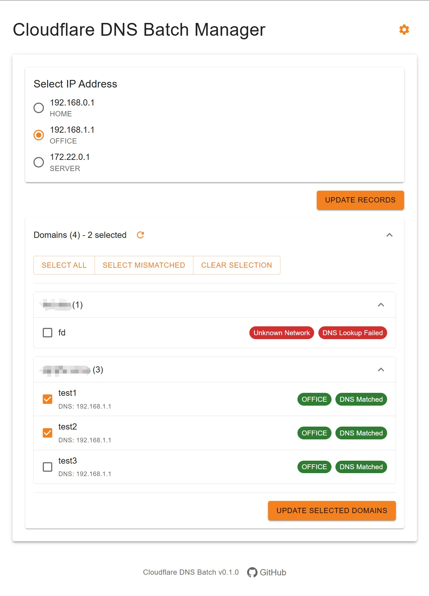
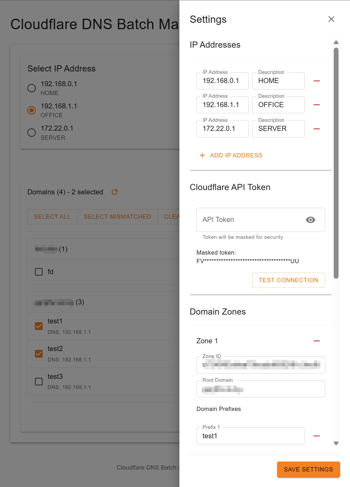

# Cloudflare DNS 批量管理工具 (cf-dns-batch)

[English](./README.md) | [中文](./README_zh-CN.md)

Cloudflare DNS 批量管理工具是一款开源Web应用，用于批量管理Cloudflare DNS记录。提供简洁界面实现IP地址选择与DNS记录更新。

本项目最初为个人需求开发。我并非专业程序员，所有代码均通过大语言模型生成。在开发前我没有任何TypeScript或React经验，也未逐行审查代码（尽管已请大语言模型解释主要功能模块）。因此无法保证应用安全性，使用者需自行承担风险。

## 屏幕截图

<div style="display: flex; justify-content: space-between;">
  
  
</div>

## 功能特性

### DNS管理
- 批量更新多条DNS记录
- 实时DNS查询验证当前记录状态（客户端视角）
- 支持多域名区域及子域名管理（单Cloudflare账户）
- 自动验证DNS记录更新

### IP地址管理
- 带描述的IP地址存储与管理
- 快速切换IP进行DNS更新
- IP地址格式验证
- 常用IP地址持久化存储

### 用户界面
- 简洁直观的Web界面
- 实时状态更新与通知
- 多域名批量选择工具
- 深色/浅色主题支持（规划中）

### 配置与安全
- 安全的Cloudflare API令牌管理
- 简易域名区域配置
- API令牌连接测试功能
- 设置备份与恢复功能（规划中）

### 部署
- Docker一键部署
- 持久化数据卷支持
- 跨平台兼容性（未完全验证）
- 低资源需求（未精确测量）

## 快速开始

### 先决条件

- Docker（用于部署）
- Cloudflare账户及API令牌

### Docker部署

#### 命令行方式

```bash
docker run -d \
  --name cf-dns-batch \
  -p 10080:80 \
  -v cf_dns_batch:/etc/cf-dns-batch \
  --restart unless-stopped \
  ganganray/cf-dns-batch:0.1.0
```

#### Docker Compose方式（推荐）

```bash
mkdir cf-dns-batch
cd cf-dns-batch
```

创建并编辑 `docker-compose.yml` ，插入以下内容：

```yaml
services:
  cf-dns-batch:
    image: ganganray/cf-dns-batch:0.1.0
    container_name: cf-dns-batch
    ports:
      - "10080:80"
    volumes:
      - cf-dns-batch:/etc/cf-dns-batch
    restart: unless-stopped

volumes:
  cf-dns-batch:
```

然后运行：

```bash
docker-compose up -d
```

访问地址：[http://DOCKER_HOST:10080](http://DOCKER_HOST:10080)

#### Docker 构建（用于开发）

```bash
git clone https://github.com/ganganray/cf-dns-batch.git
cd cf-dns-batch
docker build -t cf-dns-batch .
docker run -d \
  --name cf-dns-batch \
  -p 10080:80 \
  -v cf_dns_batch:/etc/cf-dns-batch \
  --restart unless-stopped \
  cf-dns-batch
```

## 使用指南
重要提示！如需对外公开访问，请务必通过反向代理部署，并配置TLS/SSL证书及认证系统（如Authentik）。

### 设置配置

点击右上角的“齿轮”按钮以打开设置面板。本应用设置以'settings.json'文件存储在服务端，包含以下信息：

- IP地址选项（当前仅支持IPv4）
- Cloudflare API令牌
  - 需为管理域名创建API令牌
  - 令牌验证功能仅在输入后页面刷新或设置面板重新打开前返回真实结果，页面刷新后将加载伪令牌（安全考虑）。API调直接从服务器发送真实令牌，功能不受影响。  
- 域名区域配置
  - 在Cloudflare区域概览页使用Ctrl+F查找"Zone ID"
  - '@'前缀表示根域名

## 规划功能
- Cloudflare域名代理支持
  - 客户端DNS查询与API模式切换
  - 从API获取精确代理状态
- IPv6支持
- 深色/浅色主题
- 设置备份与恢复
- 其他域名服务商支持
- 
## 开源协议
本项目采用MIT开源协议。

## 依赖与致谢
本项目使用以下开源组件：

### 前端
- React - UI框架
- Material-UI - 组件库
- Axios - HTTP客户端
- TypeScript - 编程语言
### 后端
- Node.js - JavaScript运行时
- Express - Web框架
- TypeScript - 编程语言
### 开发与部署
- Docker - 容器化技术
- Vite - 构建工具与开发服务器

Cloudflare®是Cloudflare, Inc.的注册商标。本项目与Cloudflare无任何隶属、认可或赞助关系。